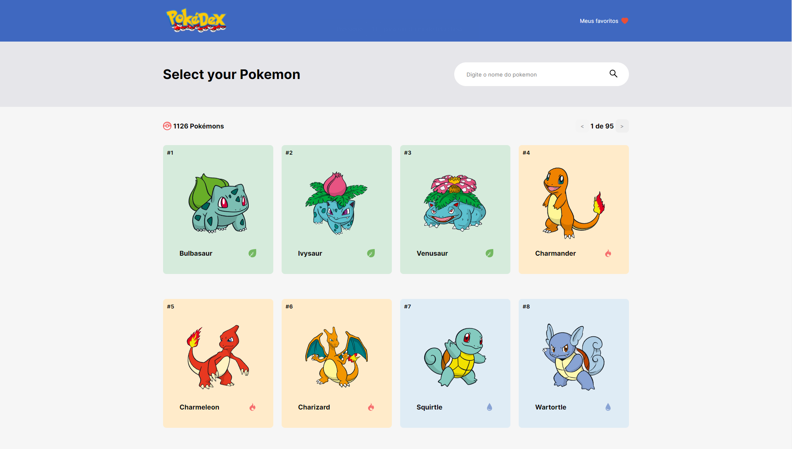

# 📖 Projeto

Este projeto foi proposto como um teste técnico para um vaga de desenvolvedor front-end. O intuito do projeto é consumir a PokeAPI e exibir as informações dos pokémons, contendo as funcionalidades de pesquisa e favoritos.

## 🧪 Tecnologias

 [](https://skillicons.dev)

## 🚀 Como executar

Para inicializar o projeto localmente siga os passos descritos abaixo:

```bash
# Clone o repositório
$ git clone https://github.com/d0ugui/pokedex.git

# Entre no repositório
$ cd pokedex

# Instale as dependências
$ npm install or yarn

# Execute a aplicação
$ npm run dev or yarn dev

# O aplicação inciará na porta:3000 - acesse <http://localhost:3000>
```

## 📝 License

Esse projeto está sob a licença MIT.
